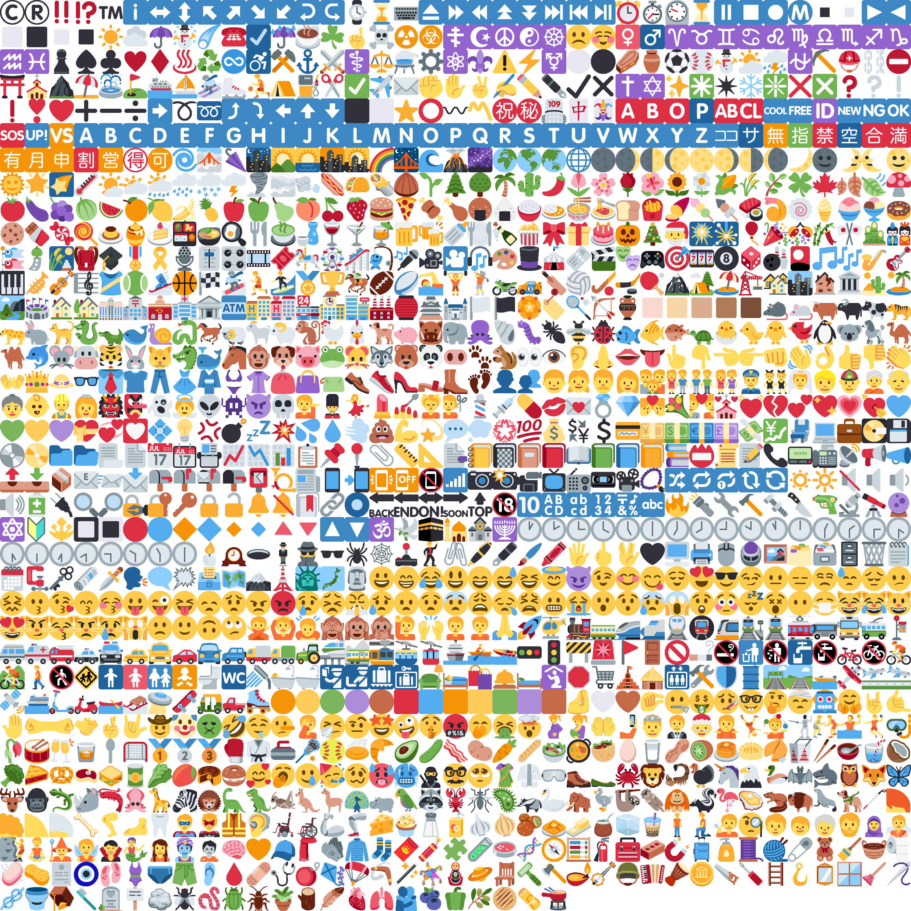

# emojiToMinecraft
Resource pack to add unicode emoji in Minecraft.
twitterやDiscordで使われているemoji[Twemoji](https://twemoji.twitter.com/)をMinecraftでも使えるようにしたリソースパックです。
1.16以上のJave editionで動作します。
 
 

 
 
 
## ダウンロード
[ここから](https://github.com/alumina6767/emojiToMinecraft/releases/latest)
 
 
 
## 似たリソースパック
[Andro's Discord Emojis](https://www.curseforge.com/minecraft/texture-packs/andros-discord-emojis)
実はこっちの方が対応文字が多い
 
 
 
## ライセンス
このリソースパックは[Twemoji](https://github.com/twitter/twemoji)の画像の一部を編集して作成しています。

Twemojiの画像データはCC-BY 4.0に基づいて作成されています。
https://github.com/twitter/twemoji/blob/master/LICENSE

以下Twemojiのlライセンス表示。 
Copyright 2020 Twitter, Inc and other contributors
Graphics licensed under CC-BY 4.0: https://creativecommons.org/licenses/by/4.0/
 
 
このリソースパックのライセンスは同じくCC-BY 4.0としますが、
大々的に使用する際は一声いただけると創作活動の糧となります。(めっちゃ喜びます)

alumina6767
https://twitter.com/alumina6767
